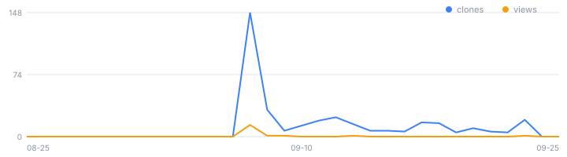

# na-openapi-mcp

<!-- mcp-name: io.github.rubatoyd/na-openapi-mcp -->

[](https://github.com/rubatoyd/na-openapi-mcp/actions/workflows/ci.yml)
[](https://github.com/rubatoyd/na-openapi-mcp/releases/latest)
[](https://github.com/rubatoyd/na-openapi-mcp/releases)

<!-- usage:start -->
> 📈 **사용량** — 최근 14일 조회 **14**회(고유 3) · 클론 **148**회(고유 61) · 릴리스 자산 누적 다운로드 **7**
>
> 
>
> <sub>2026-09-08 자동 갱신 · 전체 이력은 [`docs/usage.csv`](docs/usage.csv). GitHub 트래픽 통계는 14일 창만 제공하므로 이 저장소가 매일 찍어 누적한다.</sub>
<!-- usage:end -->

**국회도서관(National Assembly Library of Korea) 자료검색** OpenAPI 를 Claude 등 MCP
클라이언트에서 바로 쓰는 서버 + CLI. 도서·학위논문·국내외 기사·국회회의록·의안정보 등
**21종 DB** 를 검색·수집하고 xlsx/csv/json/sqlite 로 내보냅니다.

자매 프로젝트: [nl-openapi-mcp](https://github.com/rubatoyd/nl-openapi-mcp)(국립중앙도서관 단행본·회색문헌) ·
[kci-openapi-mcp](https://github.com/rubatoyd/KCI_openAPI)(학술논문·인용지수) ·
[scienceON-mcp](https://github.com/rubatoyd/scienceON-mcp)(KISTI 문헌)

---

## 이 도구가 특별히 신경 쓰는 것

### ① 미지원 검색항목이 **오류 대신 전체 카탈로그**를 돌려줍니다

이 API 최대의 함정입니다. 통합검색은 검색항목 이름을 모르면 **거부하지 않고 검색어를
통째로 무시**합니다.

```
저자,오욱환      →  total=76          ← 정상
저자명,오욱환    →  total=13,097,591  ← 전체 DB. 오류도 경고도 없다
```

`저자명` 은 **상세검색에서는 유효한 이름**이라 오타가 아니라 헷갈려서 쓰기 쉽습니다.
그대로 두면 1,300만 건을 '검색 결과'로 오인하게 됩니다.
→ 이 서버는 화이트리스트로 **호출 전에 거부**하고 올바른 이름을 알려줍니다.

| 검색항목 | `오욱환` 검색 결과 |
|---|---:|
| `전체` · `기본검색` · `자료명` · `저자` · `키워드` | 105 · 88 · 4 · 76 · 7 |
| `저자명` · `ISBN` · `발행년도` · 오타 | **각 13,097,591 (전체 DB)** |

### ② 조용한 절단 방지

받은 것이 전부인지, 잘린 것인지를 **항상 메타로 알려줍니다.**

| 신호 | 뜻 | 처방 |
|---|---|---|
| `truncated` | `max_records` 에서 멈춤 | 올리면 해결 |
| `cap_hit` | `total` > 회수 한계 — **API 가 더 안 줌** | 검색식을 쪼개야 함 |
| `early_stop_note` | 새 레코드 0으로 조기 종료 | 중복 응답·서버 이상 가능 |
| `stopped_early_note` | 예산 소진으로 **조회조차 못 한** 검색어 | `max_records` 상향 |
| `zero_yield_warning` | 수락되지만 **항상 0건**인 검색항목 | 다른 항목 사용 |
| `option_ignored_warning` | 연도 필터가 **무시됨**(통합검색) | `dbname` 함께 지정 |
| `ignored_search_warning` | 전체 카탈로그 규모가 반환됨 | 검색항목 확인 |
| `toc_enrich_truncated_note` | 목차 후보 중 **일부만** 보강됨 | `toc_max` 상향 |
| `toc_enrich_incomplete_note` | 목차 **조회 실패** 건이 있음 | 상향은 무의미 — 제어번호 확인 |
| `toc_enrich_aborted_note` | 쿼터·키 문제로 보강 **중단** | 상향은 오히려 악화 — `na_status` |

**회수 한계는 `pageno 최대 99 × page_size`** 입니다(실측). 기본값(1000)이면 99,000건이고,
`page_size` 를 낮추면 한계도 함께 낮아집니다 — 이 서버는 그것까지 반영해 보고합니다.

### ③ 공식 문서와 실제가 다른 곳을 실측으로 확정했습니다

문서(.hwp/.docx)만 보고 만들면 **조용히 깨지는** 지점들입니다.

| 항목 | 공식 문서 | ✅ 실제 |
|---|---|---|
| 레코드 태그 | `<record>` | **`<recode>`** — 문서대로면 전건 0개 회수 + `total` 은 정상 |
| `<item>` 자식 순서 | value → name | **name → value** |
| 제어번호 필드명 | `controlno` | **`제어번호`** |
| `displaylines` 상한 | 100 | **1000** |
| 인증키 | (언급 없음) | **Encoding 값을 URL 에 직접 결합**해야 함 |
| 하이라이트 마크업 | (언급 없음) | 매칭 필드에 `<font color="red">` 삽입 |

전체 대조표와 근거는 [`docs/NA_API_GUIDE.md`](docs/NA_API_GUIDE.md) 에 있습니다.

---

## 설치

### 1) Claude Code / Claude Desktop (uvx — 권장)

```json
{
  "mcpServers": {
    "na": {
      "type": "stdio",
      "command": "uvx",
      "args": ["--from", "git+https://github.com/rubatoyd/na-openapi-mcp", "na-mcp"],
      "env": { "NA_API_KEY": "발급받은_인증키" }
    }
  }
}
```

### 2) Claude Desktop `.mcpb` 원클릭

[릴리스](https://github.com/rubatoyd/na-openapi-mcp/releases/latest)에서 내려받아 실행합니다.
경량본(`na-openapi-mcp.mcpb`, uvx 경유)과 **Python·uv 없이 도는 자체완결본**
(win-x64 · macos-arm64 · linux-x64)이 있습니다.

### 3) 로컬 개발

```bash
git clone https://github.com/rubatoyd/na-openapi-mcp
cd na-openapi-mcp
uv sync --all-groups
uv run pytest -q
uv run na status
```

### 4) 다른 MCP 클라이언트

stdio 전송이 기본입니다. HTTP 가 필요하면
`na-mcp --transport streamable-http --host 127.0.0.1 --port 9126`
(환경변수 `NA_MCP_TRANSPORT`·`NA_MCP_HOST`·`NA_MCP_PORT` 도 지원).

---

## 인증키

공공데이터포털 [data.go.kr](https://www.data.go.kr) 에서 **국회 국회도서관_자료검색 서비스**
(데이터셋 `15098174`) 활용신청 후 발급받습니다. 개발계정 트래픽은 **10,000건/일** 입니다.

`na_detail`·`na_toc` 를 쓰려면 **상세정보조회 서비스**(`15098175`)도 함께 신청하세요 —
인증키는 계정 단위라 같은 키가 그대로 통합니다.

```bash
NA_API_KEY=발급받은_키          # Decoding(원문) 권장
NA_API_KEY_ENCODED=            # Encoding 값만 있으면 이쪽에
NA_OS_TRUST=1                  # 교육망·사내망 SSL 인터셉션 대응(기본 1)
```

> 🔑 data.go.kr 은 인증키를 **Encoding / Decoding 두 벌**로 줍니다. 이 API 는 **Encoding
> 값을 URL 에 직접 결합**해야 하는데(실측), 라이브러리의 `params=` 로 넘기면 `%2B` 가
> `%252B` 로 이중 인코딩되어 **조용히 인증 실패**합니다. 어느 쪽을 넣든 코드가 알아서
> 변환하므로 신경 쓰지 않아도 됩니다.

---

## MCP 도구

| 도구 | 하는 일 |
|---|---|
| `na_status` | 인증키 보유 여부 + 실제 왕복 1회 |
| `na_search` | 자료검색. 절단 신호를 함께 반환 |
| `na_collect` | 검색어 **합집합** 수집 → xlsx/csv/json/sqlite. `toc_max` 로 목차 본문 보강(기본 끔) |
| `na_detail` | 제어번호 1건 상세정보 |
| `na_toc` | 제어번호 1건 목차 |
| `na_fields` | 검색항목·dbname 유효값 + 실측 근거(census) |

### 검색어 형식

**`검색항목,키워드`** 입니다. `|` 로 이으면 **AND** 로 묶입니다.

```
전체,교육불평등
전체,교육|자료명,불평등          ← AND
```

OR(합집합)은 API 에 문법이 없어 `na_collect(terms=[…])` 가 만듭니다.

**통합검색 검색항목(7종)**: `기본검색` `전체` `자료명` `저자` `발행자` `키워드` `청구기호`

`dbname` 을 지정하면 **상세검색**으로 전환되며 검색항목 어휘가 DB마다 달라집니다
(학위논문=`논문명`·`지도교수`, 국내기사=`기사명`, 학술지·신문=`수록지명/신문명` 한 덩어리).
정확한 목록은 `na_fields` 로 확인하세요.

---

## CLI

```bash
na status
na fields                          # 검색항목·dbname 유효값 (--json 으로 census 전체)
na search "전체,교육불평등" --max-records 20
na search "저자명,양연동" --dbname 학위논문
na collect --terms "전체,교육불평등" "전체,교육격차" --max-records 2000

# 목차 본문까지 붙이기 — 건당 1회를 더 씁니다(기본 꺼져 있음). 본문은 json·sqlite 에만.
na collect --search "자료명,교육불평등" --dbname 일반도서 --toc-max 300 --formats json xlsx
na detail MONO12026000012887
na toc    MONO12026000012887

# 연도 범위는 상세검색의 option 으로만 걸립니다(통합검색에서는 무시됨)
na search "자료명,교육" --dbname 일반도서 --option "발행년도,2000|발행년도,2010"
```

---

## 응답 필드

레코드는 **고정 스키마가 아닙니다.** `<item><name>·<value>` 쌍이고 이름 집합이
자료종마다 다릅니다 — 표제 필드만 해도 `자료명`(도서) / `논문명`(학위논문) /
`기사명`(기사) / `수록지명/신문명`(학술지·신문) / `저널명`(전자저널) / `안건`(회의록) /
`의안명`(의안정보) / `번역법령명` / `표그림명` 으로 갈립니다.

알려진 이름은 공통 컬럼으로 정규화하고 **원본은 `raw` 에 그대로 보존**합니다.

주의할 값들(전부 실측):

- **안내문이 값 자리에 옵니다** — E-BOOK 의 `DDC` 는 99.95% 가 `전자형태로만 열람 가능함`
  입니다. 정규화 필드는 비우고 `placeholder_fields` 에 이름을 남깁니다(원문은 `raw` 에).
- **연도가 4자리가 아닐 수 있습니다** — `201u`(MARC 불확정 연도), 빈값, `0`.
- **`초록유무=Y` 여도 초록 본문을 받을 방법이 없습니다.** 서술형 텍스트는
  국회의안정보(`제안이유 및 주요내용`)·국회회의록(`내용`)에만 있습니다.
- **목차가 전건 없는 자료종**: E-BOOK · 학술지,잡지 · 신문 · 국외기사 · 동영상자료.

### 목차 보강(`toc_max`)을 켰을 때

목차가 안 붙는 이유가 다섯이고 **처방이 전부 다릅니다.** 같은 빈칸으로 섞으면 "이 자료에는
목차가 없다"는 잘못된 결론이 나오므로, `toc_status` 컬럼이 사유를 행 단위로 구분합니다.

| `toc_status` | 뜻 | 처방 |
|---|---|---|
| `ok` | 본문 확보 | — |
| `skipped` | `목차` 플래그가 `Y` 가 아니거나 제어번호 없음 — **호출하지 않음** | — (쿼터를 쓰지 않음) |
| `empty` | 정상 응답인데 본문이 없음 → **플래그가 거짓이었다** | — |
| `sentinel` | 본문이 `목차정보없음` 반복 | — |
| `failed` | 조회 실패 | `na_toc` 로 단건 재조회 |
| `not_attempted` | 예산 소진·중단으로 못 부름 | `toc_max` 상향 |

`has_toc='Y'` 인데 `toc_status='empty'` 인 행이 가장 중요한 신호라 두 컬럼을 나란히 둡니다.
**본문(`toc_text`)은 json·sqlite 에만** 실립니다 — 수천 자라 xlsx 셀 상한(32,767)에 걸리고
csv 를 비대하게 만듭니다.

---

## 검증 상태

- **회귀 테스트 209건.** 파서·수집기뿐 아니라 **측정 도구 자체**도 고정합니다
  (`tests/test_probe_instrumentation.py`) — 화이트리스트가 탐침의 출력이라, 탐침이 조용히
  틀리면 그 오류가 그대로 코드가 되기 때문입니다. CI 는 테스트뿐 아니라 **클라이언트가 실제로 띄울 수 있는지**를
  봅니다 — 신규 의존성 해석에서 `mcp.server.fastmcp` 존재 확인, 실제 stdio 핸드셰이크,
  도구 6종 노출, 무키 CLI 기동, 비밀 파일 미추적.
- **API 사실은 전부 라이브 왕복으로 확정**했습니다(문서·자매 프로젝트에서 옮겨 적지 않음).
  자료종 13종 필드 census 표본 약 21,000건. 재현: `scripts/probe_*.py`.
- 상세 근거와 검증 등급(✅ 실측 / 📄 문서근거 / ❓ 미검증)은
  [`docs/NA_API_GUIDE.md`](docs/NA_API_GUIDE.md) 에 있습니다.

---

## 라이선스

MIT
